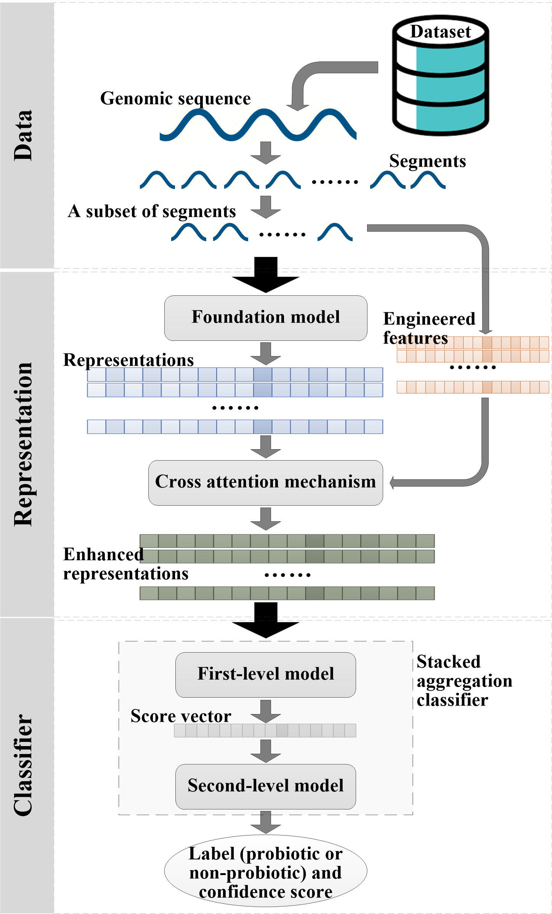

# Prediction of soil probiotics based on foundation model representation enhancement and stacked aggregation classifier

## Introduction
We use genomic foundation models to generate representations from samples’ sequences, and then, enhance them by deeply integrating domain-specific engineered features based on the cross-attention mechanism. The enhanced representations enable training a powerful classifier for a target task. We also design a stacked aggregation classifier. It predicts the label of a sample with only leveraging a subset of sequence segments from this sample, effectively addressing the challenges in processing long or incompletely assembled sequences. The proposed method is applied on prediction of soil probiotics.

## Schematic Diagram
<div style="text-align: center;">
    
</div>
Figure 1. Overview of the proposed method. The genomic sequence of a bacterial sample is split into segments. A subset of segments is input into a pre-trained foundation model to generate representations, while engineered features are extracted from these segments. The foundation model representations and engineered features are aligned, and then the foundation model representations are enhanced by deeply integrating the engineered features via the cross-attention mechanism. The stacked aggregation classifier comprises two sub-models. The first-level model processes the enhanced representations of each segment to obtain a score. All scores are aggregated into a vector, which is input into the second-level model to output the predicted label (probiotic or non-probiotic) and confidence score.

## Quick Start

### Download the GitHub Repository
[Download](https://github.com/sunhaotong0605/SPP_FMRESAC/archive/refs/heads/main.zip) this GitHub repository, and extract the contents into a folder.

### Data Description
The proposed method requires data in [FASTA](https://www.ncbi.nlm.nih.gov/genbank/fastaformat/) format as input. All data used will be made public as a supplementary table after the paper is accepted.

## Install
```bash
# Python environment constructed by Conda
conda create -n SPP_FMRESAC python=3.8.15
conda activate SPP_FMRESAC
git clone https://github.com/sunhaotong0605/SPP_FMRESAC.git
cd SPP_FMRESAC
pip install -r requirements.txt
```

## Usage
#### Foundation model weights.
* Download the weights of [Nucleotide Transformer-50M](https://huggingface.co/InstaDeepAI/nucleotide-transformer-v2-50m-multi-species) to the model_weights/NT_50M/ folder.

* Download the weights of [EVO-7B](https://huggingface.co/togethercomputer/evo-1-8k-base) to the model_weights/EVO_7B/ folder.

It is recommended to use huggingface_hub to download. Users can also download the weights to a custom location. However, they will need to specify this path as the `pretrained_model_path` when running the model.

#### Prediction for target samples.
```bash
python main.py \
    model_name=NT_50M \ # "NT_50M" or "EVO_7B"
    input_path=/path/to/input/ \
    output_path=/path/to/output/ \
    [pretrained_model_path=/path/to/model/]
```
* `model_name`: A selected foundation model for generating representations, and the candidates only can be "NT_50M" or "EVO_7B".

* `input_path`: A path of FASTA files, where each FASTA file is a target sample.

* `output_path`: A path for outputting files.

* `pretrained_model_path`: A path for pretrained foundation model weights. When the value is empty, the weights are read from model_weights/NT_50M/ or model_weights/EVO_7B/ folder by default.

The input path can contain one or multiple FASTA files (samples). For each sample, the output contains <br>
├── Sequence_segments: sequence segments <br>
├── Engineered_features: engineered features (.pkl) <br>
├── Foundation_model_representations: foundation model representations (.pkl) <br>
├── Enhanced_representations: enhanced representations (.pkl) <br>
├── Prediction_results: predicted labels and confidence scores (.txt) <br>
└── Temp: other required files <br>

If a sample's sequence has been segmented, i.e., the Sequence_segments folder has been existed in the output path, sequence segmentation step will be skipped, and existing sequence segments are directly used for prediction. 

Note: Each prediction involves randomly selecting partial segments from a sample, may result in inconsistent outputs across multiple runs due to differences in the selected segments sets.

#### Train the model on your own dataset.
```bash
python train.py \
    model_name=NT_50M \ # "NT_50M" or "EVO_7B"
    input_path=/path/to/input/ \
    output_path=/path/to/output/ \
    label_csv_path=/path/to/label.csv \
    [pretrained_model_path=/path/to/model/]
```
* `model_name`: A selected foundation model for generating representations, and the candidates only can be "NT_50M" or "EVO_7B".

* `input_path`: A path of FASTA files, where each FASTA file is a training sample.

* `output_path`: A path for outputting files.

* `pretrained_model_path`: A path for pretrained foundation model weights. When the value is empty, the weights are read from model_weights/NT_50M/ or model_weights/EVO_7B/ folder by default.

* `label_csv_path`: A CSV file containing sample names and labels of the training samples in the following format:
```csv
sample_name,label
GCA_001549735.1_XFAS004-SEQ-2-ASM-1_genomic,0
GCA_905311425.2_NRS6105B_genomic,1
GCA_000013785.1_ASM1378v1_genomic,1
GCA_000006725.1_ASM672v1_genomic,0
...
```
By default, 60% of the training samples are randomly selected to train the cross-attention mechanism, and the remaining training samples are used to train the stacked aggregation classifier. The trained weights are then saved to the output path.

#### Docker
* First, pull the docker image.
```bash
docker pull sunhaotong0605/spp_fmresac:0.0.1
```
* Download the weights of [Nucleotide Transformer-50M](https://huggingface.co/InstaDeepAI/nucleotide-transformer-v2-50m-multi-species) and [EVO-7B](https://huggingface.co/togethercomputer/evo-1-8k-base).
* Run model prediction.
```bash
docker run --rm --gpus all \
    -v /path/to/input/:/data/input \
    -v /path/to/output/:/data/output \
    -v /path/to/model/:/pretrained/model \
    -e INPUT_PATH="/data/input" \
    -e OUTPUT_PATH="/data/output" \
    -e PRETRAINED_MODEL_PATH="/pretrained/model" \
    spp_fmresac \
    sh -c 'python main.py model_name=NT_50M input_path=$INPUT_PATH output_path=$OUTPUT_PATH pretrained_model_path=$PRETRAINED_MODEL_PATH'
```
* Or run model training.
```bash
docker run --rm --gpus all \
    -v /path/to/input/:/data/input \
    -v /path/to/output/:/data/output \
    -v /path/to/model/:/pretrained/model \
    -v /path/to/label.csv:/label/csv \
    -e INPUT_PATH="/data/input" \
    -e OUTPUT_PATH="/data/output" \
    -e PRETRAINED_MODEL_PATH="/pretrained/model" \
    -e LABEL_CSV_PATH="/label/csv" \
    spp_fmresac \
    sh -c 'python train.py model_name=NT_50M input_path=$INPUT_PATH output_path=$OUTPUT_PATH pretrained_model_path=$PRETRAINED_MODEL_PATH label_csv_path=$LABEL_CSV_PATH'
```
Please replace `/path/to/input/`, `/path/to/output/`, `/path/to/model/`and `/path/to/label.csv` with your own path. `model_name` can be "NT_50M" or "EVO_7B".

## License
MIT License. See [LICENSE](LICENSE.txt) for details.

## Citation
Kang Q, Sun H, Wang Y, et al. Prediction of soil probiotics based on foundation model representation enhancement and stacked aggregation classifier. bioRxiv. doi:https://doi.org/10.1101/2025.06.13.659431.
